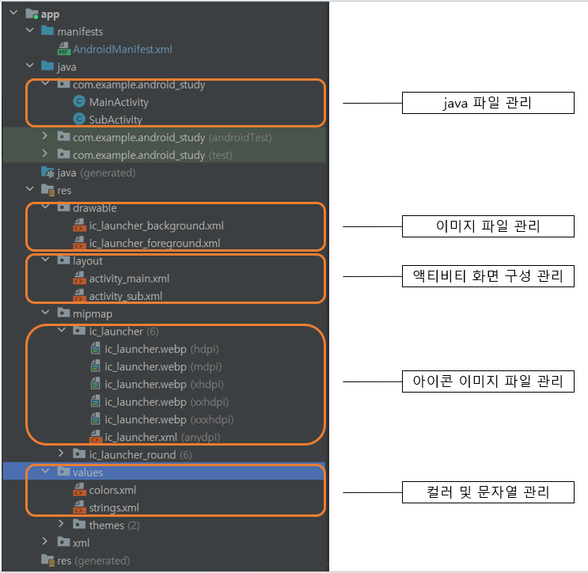

# 패키지 구조 및 역할

AndroidMainifast.xml파일과 안드로이드 앱 파일 구조에 대해 알아본다.

## AndroidMainifast.xml

앱을 구성하는데에 있어서 중요한 파일이다. 아래와 같이 AndroidMainifast.xml이 기본 구성되어 있다. 

```
<?xml version="1.0" encoding="utf-8"?>
<manifest xmlns:android="http://schemas.android.com/apk/res/android"
    xmlns:tools="http://schemas.android.com/tools">

    <application
        android:allowBackup="true"
        android:dataExtractionRules="@xml/data_extraction_rules"
        android:fullBackupContent="@xml/backup_rules"
        android:icon="@mipmap/ic_launcher" <!--아이콘 이미지 지정-->
        android:label="@string/app_name" <!--앱 이름 지정-->
        android:roundIcon="@mipmap/ic_launcher_round" <!--아이콘 이미지 라운드 지정-->
        android:supportsRtl="true"
        android:theme="@style/Theme.Android_study" <!--기본 색상 지정-->
        tools:targetApi="31">

        <activity  <!--액티비티 지정-->
            android:name=".MainActivity"
            android:exported="true">
            <intent-filter>
                <action android:name="android.intent.action.MAIN" />

                <category android:name="android.intent.category.LAUNCHER" />

            <!--앱 실행할 때 나오는 첫 화면-->
            </intent-filter>
        </activity>

        <activity
            android:name=".SubActivity"
            android:exported="false" />

        <!--모든 액티비티를 AndroidMainifast.xml이 파일에 지정해야 함-->

    </application>

</manifest>
```

## 앱 파일 구조

앱 파일 구조는 아래와 같이 구성되어 있다.

